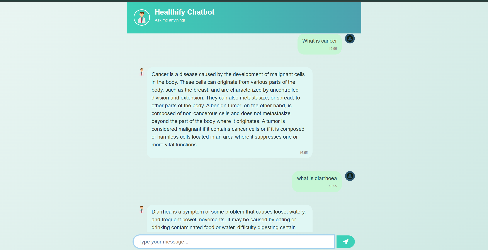

#MediBot

A conversational AI chatbot designed to assist users with medical queries by leveraging advanced NLP models and retrieval-augmented generation(RAG) from medical documents.

## Features

- Chat interface for real-time medical Q&A
- Utilizes state-of-the-art language models (HuggingFace)
- Retrieves information from uploaded medical PDFs
- User-friendly web interface built with Flask and Bootstrap

## Tech Stack

- **Backend:** Python, Flask
- **NLP & AI:** 
  - [sentence-transformers](https://www.sbert.net/)
  - [langchain](https://python.langchain.com/)
  - [HuggingFace Transformers](https://huggingface.co/)
- **Document Processing:** pypdf
- **Vector Database:** Pinecone
- **Frontend:** HTML, CSS ([Bootstrap](https://getbootstrap.com/)), JavaScript, jQuery
- **Environment Management:** python-dotenv

## Project Structure

```
.
├── app.py                # Main Flask application
├── src/                  # Helper modules and prompt engineering
├── templates/            # HTML templates (chat interface)
├── static/               # Static files (CSS, images)
├── data/                 # Medical documents (PDFs)
├── requirement.txt       # Python dependencies
```

## Preview

Below is a screenshot of the final look of the chatbot interface:



## Setup Instructions

1. **Clone the repository**
2. **Install dependencies**
   ```sh
   pip install -r requirement.txt
   ```
3. **Configure API keys**  
   Add your OpenAI, Pinecone, and HuggingFace API keys in the `.env` file.

4. **Run the application**
   ```sh
   python app.py
   ```

5. **Access the chatbot**  
   Open your browser and go to `http://localhost:5000`

## License

This project is for educational and research purposes only.